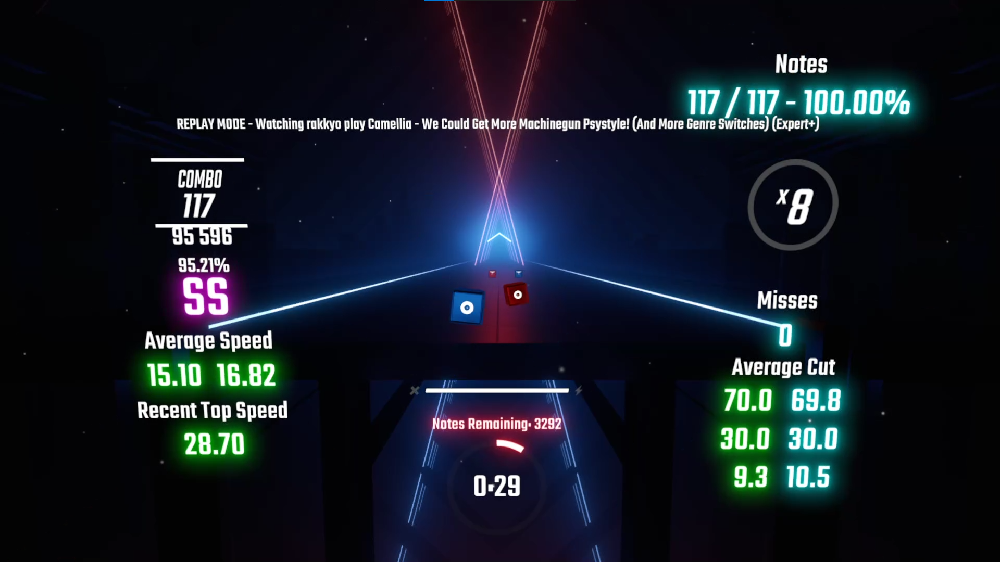

## The English version of README is [here](README_EN.md)

# CounterPlus���ǔ�

## �I���W�i���o�[�W�����Ƃ̈Ⴂ
ScoreCounter,ProgressCounter,CutCounter,MissCounter,NoteCounter,NoteLeftCounter,SpeedCounter�ɂ����āA�C�ӂ�臒l���ƂɔC�ӂ̐F��t���邱�Ƃ��ł���悤�ɂ��܂����B 
[CenterDistanceCounter](https://github.com/rakkyo150/CenterDistanceCounter)�̂��߁A�a��ꂽ�m�[�c�̏�����ڍׂɓ��邱�Ƃ��ł���C���^�[�t�F�C�X����܂����B

## �ݒ荀��
�I���W�i���o�[�W�����Ƃ͈قȂ镔���̂ݎ��グ��̂ŁA���������������B

### ScoreCounter
閾値と色は７段階に分けられています。 
|項目|説明|
|:---|:---|
|`Bloom`|光らせるかどうか|
|`Custom Score Colors`|色をつけるかどうか|
|`Score1 Threshold`|100%からどこまでの範囲か|
|`Score2 Threshold`|`Score1 Threshold`からどこまでの範囲か|
|`Score3 Threshold`|`Score2 Threshold`からどこまでの範囲か|
|`Score4 Threshold`|`Score3 Threshold`からどこまでの範囲か|
|`Score5 Threshold`|`Score4 Threshold`からどこまでの範囲か|
|`Score6 Threshold`|`Score5 Threshold`からどこまでの範囲か|
|`Score1 Color`|`Score1 Threshold`～115における色を選択|
|`Score2 Color`|`Score2 Threshold`～`Score1 Threshold`における色を選択|
|`Score3 Color`|`Score3 Threshold`～`Score2 Threshold`における色を選択|
|`Score4 Color`|`Score4 Threshold`～`Score3 Threshold`における色を選択|
|`Score5 Color`|`Score5 Threshold`～`Score4 Threshold`における色を選択|
|`Score6 Color`|`Score6 Threshold`～`Score5 Threshold`における色を選択|
|`Score7 Color`|`Score6 Threshold`以下における色を選択|

### ProgressCounter
閾値と色は７段階に分けられています。
|項目|説明|
|:---|:---|
|`Bloom`|光らせるかどうか|
|`Custom Progress Colors`|色をつけるかどうか|
|`Progress1 Threshold`|曲スタートからどこまでの範囲か|
|`Progress2 Threshold`|`Progress1 Threshold`からどこまでの範囲か|
|`Progress3 Threshold`|`Progress2 Threshold`からどこまでの範囲か|
|`Progress4 Threshold`|`Progress3 Threshold`からどこまでの範囲か|
|`Progress5 Threshold`|`Progress4 Threshold`からどこまでの範囲か|
|`Progress6 Threshold`|`Progress5 Threshold`からどこまでの範囲か|
|`Progress1 Color`|曲スタート～`Progress1 Threshold`における色を選択|
|`Progress2 Color`|`Progress2 Threshold`～`Progress1 Threshold`における色を選択|
|`Progress3 Color`|`Progress3 Threshold`～`Progress2 Threshold`における色を選択|
|`Progress4 Color`|`Progress4 Threshold`～`Progress3 Threshold`における色を選択|
|`Progress5 Color`|`Progress5 Threshold`～`Progress4 Threshold`における色を選択|
|`Progress6 Color`|`Progress6 Threshold`～`Progress5 Threshold`における色を選択|
|`Progress7 Color`|`Progress6 Threshold`以下における色を選択|

### CutCounter
閾値と色は７段階に分けられています。
|項目|説明|
|:---|:---|
|`Bloom`|光らせるかどうか|
|`Custom Cut Colors`|色をつけるかどうか|
|`Cut1 Threshold`|115からどこまでの範囲か|
|`Cut2 Threshold`|`Cut1 Threshold`からどこまでの範囲か|
|`Cut3 Threshold`|`Cut2 Threshold`からどこまでの範囲か|
|`Cut4 Threshold`|`Cut3 Threshold`からどこまでの範囲か|
|`Cut5 Threshold`|`Cut4 Threshold`からどこまでの範囲か|
|`Cut6 Threshold`|`Cut5 Threshold`からどこまでの範囲か|
|`Cut1 Color`|`Cut1 Threshold`～115における色を選択|
|`Cut2 Color`|`Cut2 Threshold`～`Cut1 Threshold`における色を選択|
|`Cut3 Color`|`Cut3 Threshold`～`Cut2 Threshold`における色を選択|
|`Cut4 Color`|`Cut4 Threshold`～`Cut3 Threshold`における色を選択|
|`Cut5 Color`|`Cut5 Threshold`～`Cut4 Threshold`における色を選択|
|`Cut6 Color`|`Cut6 Threshold`～`Cut5 Threshold`における色を選択|
|`Cut7 Color`|`Cut6 Threshold`以下における色を選択|

### MissCounter
閾値と色は７段階に分けられています。
|項目|説明|
|:---|:---|
|`Bloom`|光らせるかどうか|
|`Custom Miss Colors`|色をつけるかどうか|
|`Miss1 Threshold`|ミス０からどこまでの範囲か|
|`Miss2 Threshold`|`Miss1 Threshold`からどこまでの範囲か|
|`Miss3 Threshold`|`Miss2 Threshold`からどこまでの範囲か|
|`Miss4 Threshold`|`Miss3 Threshold`からどこまでの範囲か|
|`Miss5 Threshold`|`Miss4 Threshold`からどこまでの範囲か|
|`Miss6 Threshold`|`Miss5 Threshold`からどこまでの範囲か|
|`Miss1 Color`|ミス０～`Miss1 Threshold`における色を選択|
|`Miss2 Color`|`Miss2 Threshold`～`Miss1 Threshold`における色を選択|
|`Miss3 Color`|`Miss3 Threshold`～`Miss2 Threshold`における色を選択|
|`Miss4 Color`|`Miss4 Threshold`～`Miss3 Threshold`における色を選択|
|`Miss5 Color`|`Miss5 Threshold`～`Miss4 Threshold`における色を選択|
|`Miss6 Color`|`Miss6 Threshold`～`Miss5 Threshold`における色を選択|
|`Miss7 Color`|`Miss6 Threshold`以下における色を選択|

### NoteCounter
臒l�ƐF�͂V�i�K�ɕ������Ă��܂��B
|����|���|
|:---|:---|
|`Bloom`|���点�邩�ǂ���|
|`Custom Note Colors`|�F��‚��邩�ǂ���|
|`Note1 Threshold`|goodcut100������ǂ��܂ł͈̔͂�|
|`Note2 Threshold`|`Note1 Threshold`����ǂ��܂ł͈̔͂�|
|`Note3 Threshold`|`Note2 Threshold`����ǂ��܂ł͈̔͂�|
|`Note4 Threshold`|`Note3 Threshold`����ǂ��܂ł͈̔͂�|
|`Note5 Threshold`|`Note4 Threshold`����ǂ��܂ł͈̔͂�|
|`Note6 Threshold`|`Note5 Threshold`����ǂ��܂ł͈̔͂�|
|`Note1 Color`|`Note1 Threshold`�`100%�ɂ�����F��I��|
|`Note2 Color`|`Note2 Threshold`�``Note1 Threshold`�ɂ�����F��I��|
|`Note3 Color`|`Note3 Threshold`�``Note2 Threshold`�ɂ�����F��I��|
|`Note4 Color`|`Note4 Threshold`�``Note3 Threshold`�ɂ�����F��I��|
|`Note5 Color`|`Note5 Threshold`�``Note4 Threshold`�ɂ�����F��I��|
|`Note6 Color`|`Note6 Threshold`�``Note5 Threshold`�ɂ�����F��I��|
|`Note7 Color`|`Note6 Threshold`�ȉ��ɂ�����F��I��|

### NoteLeftCounter
臒l�͂V�i�K�A�F�͂W�i�K�ɕ������Ă��܂��B
|����|���|
|:---|:---|
|`Bloom`|���点�邩�ǂ���|
|`Custom Notes Left Colors`|�F��‚��邩�ǂ���|
|`Left1 Threshold`|�c��m�[�c100%����ǂ��܂ł͈̔͂�|
|`Left2 Threshold`|`Left1 Threshold`����ǂ��܂ł͈̔͂�|
|`Left3 Threshold`|`Left2 Threshold`����ǂ��܂ł͈̔͂�|
|`Left4 Threshold`|`Left3 Threshold`����ǂ��܂ł͈̔͂�|
|`Left5 Threshold`|`Left4 Threshold`����ǂ��܂ł͈̔͂�|
|`Left6 Threshold`|`Left5 Threshold`����ǂ��܂ł͈̔͂�|
|`Left1 Color`|`Left1 Threshold`�`100%�ɂ�����F��I��|
|`Left2 Color`|`Left2 Threshold`�``Left1 Threshold`�ɂ�����F��I��|
|`Left3 Color`|`Left3 Threshold`�``Left2 Threshold`�ɂ�����F��I��|
|`Left4 Color`|`Left4 Threshold`�``Left3 Threshold`�ɂ�����F��I��|
|`Left5 Color`|`Left5 Threshold`�``Left4 Threshold`�ɂ�����F��I��|
|`Left6 Color`|`Left6 Threshold`�``Left5 Threshold`�ɂ�����F��I��|
|`Left7 Color`|`Left6 Threshold`�ȉ��ɂ�����F��I��|
|`Note Last Color`|�c��m�[�c���O�̂Ƃ��̐F��I��|

## SpeedCounter
閾値と色は７段階に分けられています。
|項目|説明|
|:---|:---|
|`Bloom`|光らせるかどうか|
|`Custom Speed Colors`|色をつけるかどうか|
|`Speed1 Threshold`|最速はどこからか|
|`Speed2 Threshold`|`Speed1 Threshold`からどこまでの範囲か|
|`Speed3 Threshold`|`Speed2 Threshold`からどこまでの範囲か|
|`Speed4 Threshold`|`Speed3 Threshold`からどこまでの範囲か|
|`Speed5 Threshold`|`Speed4 Threshold`からどこまでの範囲か|
|`Speed6 Threshold`|`Speed5 Threshold`からどこまでの範囲か|
|`Speed1 Color`|`Speed1 Threshold`以上における色を選択|
|`Speed2 Color`|`Speed2 Threshold`～`Speed1 Threshold`における色を選択|
|`Speed3 Color`|`Speed3 Threshold`～`Speed2 Threshold`における色を選択|
|`Speed4 Color`|`Speed4 Threshold`～`Speed3 Threshold`における色を選択|
|`Speed5 Color`|`Speed5 Threshold`～`Speed4 Threshold`における色を選択|
|`Speed6 Color`|`Speed6 Threshold`～`Speed5 Threshold`における色を選択|
|`Speed7 Color`|`Speed6 Threshold`以下における色を選択|
