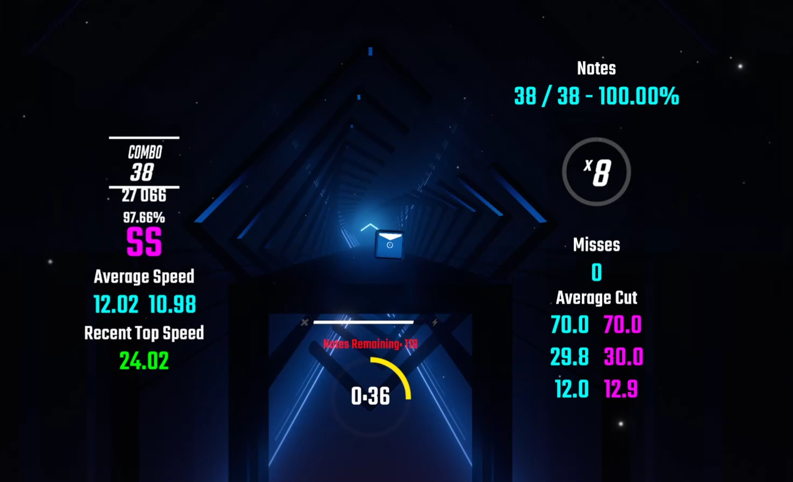

# CounterPlus改良版

## オリジナルバージョンとの違い
ScoreCounter,ProgressCounter,CutCounter,MissCounter,NoteCounter,NoteLeftCounter,SpeedCounterにおいて、任意の閾値ごとに任意の色を付けることができるようにしました。 

## 設定項目
オリジナルバージョンとは異なる部分のみ取り上げるので、ご了承ください。

### ScoreCounter
閾値と色は７段階に分けられています。 
また、NalulunaCountersのColored HUDを有効にしている場合はそちらが優先されます。 
|項目|説明|
|:---|:---|
|`Custom Score Colors`|色をつけるかどうか|
|`Score1 Threshold`|100%からどこまでの範囲か|
|`Score2 Threshold`|`Score1 Threshold`からどこまでの範囲か|
|`Score3 Threshold`|`Score2 Threshold`からどこまでの範囲か|
|`Score4 Threshold`|`Score3 Threshold`からどこまでの範囲か|
|`Score5 Threshold`|`Score4 Threshold`からどこまでの範囲か|
|`Score6 Threshold`|`Score5 Threshold`からどこまでの範囲か|
|`Score1 Color`|`Score1 Threshold`〜115における色を選択|
|`Score2 Color`|`Score2 Threshold`〜`Score1 Threshold`における色を選択|
|`Score3 Color`|`Score3 Threshold`〜`Score2 Threshold`における色を選択|
|`Score4 Color`|`Score4 Threshold`〜`Score3 Threshold`における色を選択|
|`Score5 Color`|`Score5 Threshold`〜`Score4 Threshold`における色を選択|
|`Score6 Color`|`Score6 Threshold`〜`Score5 Threshold`における色を選択|
|`Score7 Color`|`Score6 Threshold`以下における色を選択|

### ProgressCounter
閾値と色は７段階に分けられています。
|項目|説明|
|:---|:---|
|`Custom Progress Colors`|色をつけるかどうか|
|`Progress1 Threshold`|曲スタートからどこまでの範囲か|
|`Progress2 Threshold`|`Progress1 Threshold`からどこまでの範囲か|
|`Progress3 Threshold`|`Progress2 Threshold`からどこまでの範囲か|
|`Progress4 Threshold`|`Progress3 Threshold`からどこまでの範囲か|
|`Progress5 Threshold`|`Progress4 Threshold`からどこまでの範囲か|
|`Progress6 Threshold`|`Progress5 Threshold`からどこまでの範囲か|
|`Progress1 Color`|曲スタート〜`Progress1 Threshold`における色を選択|
|`Progress2 Color`|`Progress2 Threshold`〜`Progress1 Threshold`における色を選択|
|`Progress3 Color`|`Progress3 Threshold`〜`Progress2 Threshold`における色を選択|
|`Progress4 Color`|`Progress4 Threshold`〜`Progress3 Threshold`における色を選択|
|`Progress5 Color`|`Progress5 Threshold`〜`Progress4 Threshold`における色を選択|
|`Progress6 Color`|`Progress6 Threshold`〜`Progress5 Threshold`における色を選択|
|`Progress7 Color`|`Progress6 Threshold`以下における色を選択|

### CutCounter
閾値と色は７段階に分けられています。
|項目|説明|
|:---|:---|
|`Custom Cut Colors`|色をつけるかどうか|
|`Cut1 Threshold`|115からどこまでの範囲か|
|`Cut2 Threshold`|`Cut1 Threshold`からどこまでの範囲か|
|`Cut3 Threshold`|`Cut2 Threshold`からどこまでの範囲か|
|`Cut4 Threshold`|`Cut3 Threshold`からどこまでの範囲か|
|`Cut5 Threshold`|`Cut4 Threshold`からどこまでの範囲か|
|`Cut6 Threshold`|`Cut5 Threshold`からどこまでの範囲か|
|`Cut1 Color`|`Cut1 Threshold`〜115における色を選択|
|`Cut2 Color`|`Cut2 Threshold`〜`Cut1 Threshold`における色を選択|
|`Cut3 Color`|`Cut3 Threshold`〜`Cut2 Threshold`における色を選択|
|`Cut4 Color`|`Cut4 Threshold`〜`Cut3 Threshold`における色を選択|
|`Cut5 Color`|`Cut5 Threshold`〜`Cut4 Threshold`における色を選択|
|`Cut6 Color`|`Cut6 Threshold`〜`Cut5 Threshold`における色を選択|
|`Cut7 Color`|`Cut6 Threshold`以下における色を選択|

### MissCounter
閾値と色は７段階に分けられています。
|項目|説明|
|:---|:---|
|`Custom Miss Colors`|色をつけるかどうか|
|`Miss1 Threshold`|ミス０からどこまでの範囲か|
|`Miss2 Threshold`|`Miss1 Threshold`からどこまでの範囲か|
|`Miss3 Threshold`|`Miss2 Threshold`からどこまでの範囲か|
|`Miss4 Threshold`|`Miss3 Threshold`からどこまでの範囲か|
|`Miss5 Threshold`|`Miss4 Threshold`からどこまでの範囲か|
|`Miss6 Threshold`|`Miss5 Threshold`からどこまでの範囲か|
|`Miss1 Color`|ミス０〜`Miss1 Threshold`における色を選択|
|`Miss2 Color`|`Miss2 Threshold`〜`Miss1 Threshold`における色を選択|
|`Miss3 Color`|`Miss3 Threshold`〜`Miss2 Threshold`における色を選択|
|`Miss4 Color`|`Miss4 Threshold`〜`Miss3 Threshold`における色を選択|
|`Miss5 Color`|`Miss5 Threshold`〜`Miss4 Threshold`における色を選択|
|`Miss6 Color`|`Miss6 Threshold`〜`Miss5 Threshold`における色を選択|
|`Miss7 Color`|`Miss6 Threshold`以下における色を選択|

### NoteCounter
閾値と色は７段階に分けられています。
|項目|説明|
|:---|:---|
|`Custom Note Colors`|色をつけるかどうか|
|`Note1 Threshold`|goodcut100％からどこまでの範囲か|
|`Note2 Threshold`|`Note1 Threshold`からどこまでの範囲か|
|`Note3 Threshold`|`Note2 Threshold`からどこまでの範囲か|
|`Note4 Threshold`|`Note3 Threshold`からどこまでの範囲か|
|`Note5 Threshold`|`Note4 Threshold`からどこまでの範囲か|
|`Note6 Threshold`|`Note5 Threshold`からどこまでの範囲か|
|`Note1 Color`|`Note1 Threshold`〜100%における色を選択|
|`Note2 Color`|`Note2 Threshold`〜`Note1 Threshold`における色を選択|
|`Note3 Color`|`Note3 Threshold`〜`Note2 Threshold`における色を選択|
|`Note4 Color`|`Note4 Threshold`〜`Note3 Threshold`における色を選択|
|`Note5 Color`|`Note5 Threshold`〜`Note4 Threshold`における色を選択|
|`Note6 Color`|`Note6 Threshold`〜`Note5 Threshold`における色を選択|
|`Note7 Color`|`Note6 Threshold`以下における色を選択|

### NoteLeftCounter
閾値は７段階、色は８段階に分けられています。
|項目|説明|
|:---|:---|
|`Custom Notes Left Colors`|色をつけるかどうか|
|`Left1 Threshold`|残りノーツ100%からどこまでの範囲か|
|`Left2 Threshold`|`Left1 Threshold`からどこまでの範囲か|
|`Left3 Threshold`|`Left2 Threshold`からどこまでの範囲か|
|`Left4 Threshold`|`Left3 Threshold`からどこまでの範囲か|
|`Left5 Threshold`|`Left4 Threshold`からどこまでの範囲か|
|`Left6 Threshold`|`Left5 Threshold`からどこまでの範囲か|
|`Left1 Color`|`Left1 Threshold`〜100%における色を選択|
|`Left2 Color`|`Left2 Threshold`〜`Left1 Threshold`における色を選択|
|`Left3 Color`|`Left3 Threshold`〜`Left2 Threshold`における色を選択|
|`Left4 Color`|`Left4 Threshold`〜`Left3 Threshold`における色を選択|
|`Left5 Color`|`Left5 Threshold`〜`Left4 Threshold`における色を選択|
|`Left6 Color`|`Left6 Threshold`〜`Left5 Threshold`における色を選択|
|`Left7 Color`|`Left6 Threshold`以下における色を選択|
|`Note Last Color`|残りノーツが０のときの色を選択|

## SpeedCounter
閾値と色は７段階に分けられています。
|項目|説明|
|:---|:---|
|`Custom Speed Colors`|色をつけるかどうか|
|`Speed1 Threshold`|最速はどこからか|
|`Speed2 Threshold`|`Speed1 Threshold`からどこまでの範囲か|
|`Speed3 Threshold`|`Speed2 Threshold`からどこまでの範囲か|
|`Speed4 Threshold`|`Speed3 Threshold`からどこまでの範囲か|
|`Speed5 Threshold`|`Speed4 Threshold`からどこまでの範囲か|
|`Speed6 Threshold`|`Speed5 Threshold`からどこまでの範囲か|
|`Speed1 Color`|`Speed1 Threshold`以上における色を選択|
|`Speed2 Color`|`Speed2 Threshold`〜`Speed1 Threshold`における色を選択|
|`Speed3 Color`|`Speed3 Threshold`〜`Speed2 Threshold`における色を選択|
|`Speed4 Color`|`Speed4 Threshold`〜`Speed3 Threshold`における色を選択|
|`Speed5 Color`|`Speed5 Threshold`〜`Speed4 Threshold`における色を選択|
|`Speed6 Color`|`Speed6 Threshold`〜`Speed5 Threshold`における色を選択|
|`Speed7 Color`|`Speed6 Threshold`以下における色を選択|
